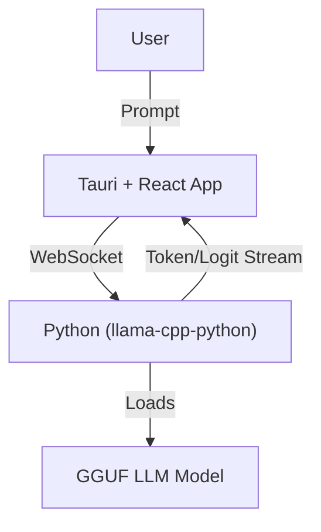

# Architecture Overview

## System Overview
- Local desktop app (Tauri + React frontend, Python backend)
- Runs LLM inference locally using GGUF models

## System Diagram

## Data Flow
1. User loads model and enters prompt in UI
2. Frontend sends prompt to backend via WebSocket
3. Backend streams generated tokens and top-k logits
4. Frontend visualizes tokens and logits in real time

## Backend Responsibilities
- Model loading, inference, token/logit extraction
- WebSocket server for streaming data

## Frontend Responsibilities
- UI for prompt input, controls, and visualization
- WebSocket client for real-time updates

## Diagrams
- [x] System diagram (see above)
- [ ] Data flow chart (to be added) 