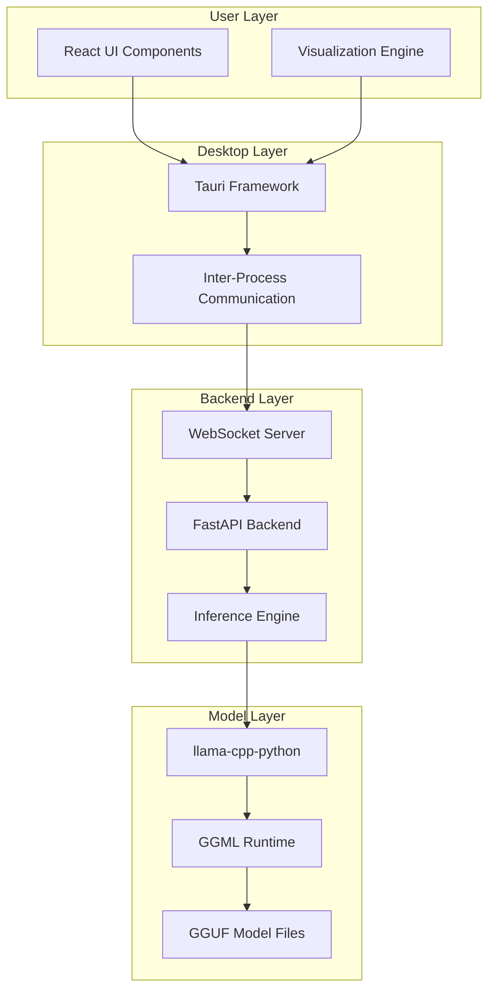
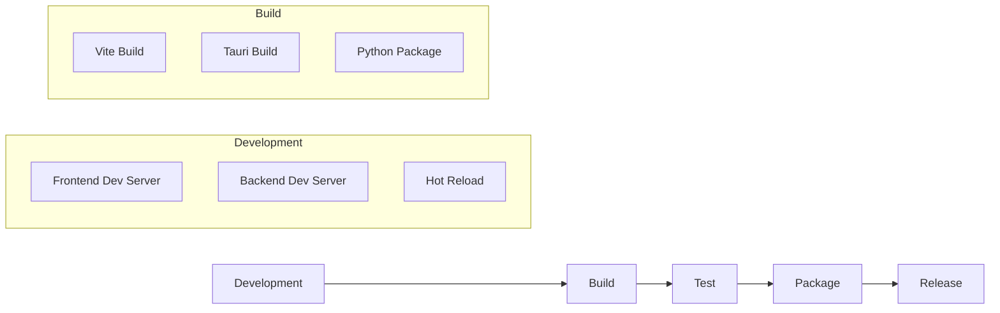

# Architecture Overview

This document provides a detailed overview of Inferno's architecture, design decisions, and technical implementation.

## High-Level Architecture

Inferno follows a **hybrid desktop application architecture** with clear separation between the inference engine and user interface:



## Component Overview

### Frontend (Tauri + React)
- **Framework**: Tauri (Rust) with React (TypeScript)
- **Purpose**: Desktop application shell and user interface
- **Responsibilities**:
  - Rendering real-time visualizations
  - Managing user input and controls
  - Handling WebSocket communication
  - Providing native desktop experience

### Backend (Python)
- **Framework**: FastAPI with llama-cpp-python
- **Purpose**: Model inference and data processing
- **Responsibilities**:
  - Loading and managing GGUF models
  - Running token-by-token inference
  - Extracting logits and probabilities
  - Streaming data via WebSocket

## Detailed Component Architecture

### Frontend Architecture

```
frontend/
├── src/
│   ├── components/          # React UI components
│   │   ├── ModelLoader/     # Model selection and loading
│   │   ├── TokenStream/     # Real-time token display
│   │   ├── LogitsView/      # Probability visualization
│   │   └── Controls/        # Inference controls
│   ├── hooks/               # React hooks for state management
│   ├── services/            # WebSocket and API communication
│   ├── types/               # TypeScript type definitions
│   └── utils/               # Utility functions
├── src-tauri/               # Tauri Rust backend
│   ├── src/
│   │   ├── main.rs          # Tauri main process
│   │   └── commands.rs      # Tauri commands
│   └── Cargo.toml           # Rust dependencies
└── package.json             # Node.js dependencies
```

#### Key Frontend Components

**1. TokenStream Component**
- Renders tokens as they're generated
- Handles color coding based on confidence
- Manages scrolling and viewport optimization
- Updates in real-time via WebSocket

**2. LogitsView Component**
- Visualizes probability distributions
- Shows top-k token candidates
- Provides interactive exploration of alternatives
- Updates synchronously with token generation

**3. ModelLoader Component**
- File browser for GGUF models
- Loading progress indication
- Model metadata display
- Error handling and validation

**4. Controls Component**
- Inference parameter controls (temperature, top-k, etc.)
- Start/stop/pause generation controls
- Export and session management
- Settings and configuration

### Backend Architecture

```
backend/
├── main.py                  # Application entry point
├── config.py                # Configuration management
├── server/
│   ├── websocket.py         # WebSocket server implementation
│   ├── api.py               # FastAPI routes and handlers
│   └── middleware.py        # Request/response middleware
├── inference/
│   ├── engine.py            # Core inference logic
│   ├── model_loader.py      # GGUF model management
│   ├── tokenizer.py         # Tokenization utilities
│   └── streaming.py         # Real-time streaming logic
├── tests/                   # Unit and integration tests
└── requirements.txt         # Python dependencies
```

#### Key Backend Components

**1. Inference Engine** (`inference/engine.py`)
- Wraps llama-cpp-python functionality
- Manages model state and context
- Handles token-by-token generation
- Extracts logits and probabilities

**2. WebSocket Server** (`server/websocket.py`)
- Real-time bidirectional communication
- Message routing and handling
- Error handling and reconnection logic
- Stream management and backpressure

**3. Model Loader** (`inference/model_loader.py`)
- GGUF file validation and loading
- Model metadata extraction
- Memory management and optimization
- Compatibility checking

**4. Streaming Handler** (`inference/streaming.py`)
- Token-by-token data streaming
- Logits extraction and processing
- Real-time data serialization
- Performance optimization

## Data Flow

### Model Loading Flow
1. User selects GGUF file via frontend file browser
2. Frontend sends load request to backend via WebSocket
3. Backend validates file and extracts metadata
4. Model is loaded into memory using llama-cpp-python
5. Loading progress and completion status streamed to frontend
6. Model metadata displayed in UI

### Inference Flow
1. User enters prompt and configures parameters
2. Frontend sends inference request via WebSocket
3. Backend initializes inference session
4. For each generation step:
   - Model predicts next token probabilities
   - Backend extracts logits and selects token
   - Token and probability data streamed to frontend
   - Frontend updates visualizations in real-time
5. Generation continues until completion or user stops

### Real-Time Communication

**WebSocket Message Types:**
```typescript
// Model management
ModelLoadRequest { file_path: string }
ModelLoadProgress { progress: number, stage: string }
ModelLoadComplete { metadata: ModelMetadata }

// Inference control
InferenceRequest { prompt: string, parameters: InferenceParams }
InferenceToken { token: string, logits: number[], timestamp: number }
InferenceComplete { total_tokens: number, duration: number }

// Error handling
ErrorMessage { type: string, message: string, context?: any }
```

## Performance Considerations

### Memory Management
- **Model Loading**: Models loaded once and kept in memory
- **Context Management**: Sliding window for long conversations
- **Garbage Collection**: Proper cleanup of inference sessions
- **Memory Monitoring**: Real-time RAM usage tracking

### Real-Time Performance
- **Streaming Optimization**: Minimal latency token delivery
- **Backpressure Handling**: Prevents frontend overflow
- **Efficient Serialization**: Optimized JSON message format
- **Visualization Performance**: Canvas-based rendering for large token sequences

### Scalability
- **Single Model Limitation**: Currently supports one model at a time
- **Future Multi-Model**: Architecture designed for future expansion
- **Resource Isolation**: Each inference session is isolated
- **Graceful Degradation**: Performance scales with available resources

## Security Architecture

### Local-First Design
- **No External Communication**: All processing happens locally
- **File System Access**: Controlled via Tauri's security model
- **Process Isolation**: Frontend and backend run in separate processes
- **Permission Model**: Minimal required permissions

### Data Privacy
- **No Telemetry**: No usage data collection
- **No Logging**: Sensitive data not logged to disk
- **Memory Security**: Proper cleanup of sensitive data
- **File Access**: Read-only access to model files

## Development Architecture

### Build System
- **Frontend**: Vite + TypeScript + React
- **Backend**: Python with pip/pipenv
- **Desktop**: Tauri build system
- **Cross-Platform**: Unified build for Windows/macOS/Linux

### Testing Strategy
- **Frontend**: Jest + React Testing Library
- **Backend**: pytest + asyncio testing
- **Integration**: End-to-end WebSocket testing
- **Model Testing**: Compatibility testing with various GGUF models

### Development Workflow


## Technology Stack

### Frontend Technologies
- **Tauri**: Cross-platform desktop framework
- **React 18**: UI library with hooks and suspense
- **TypeScript**: Type-safe JavaScript
- **Vite**: Fast build tool and dev server
- **D3.js**: Data visualization (for probability charts)
- **WebSocket API**: Real-time communication

### Backend Technologies
- **Python 3.10+**: Core language
- **FastAPI**: Modern async web framework
- **llama-cpp-python**: GGUF model inference
- **uvicorn**: ASGI server
- **pydantic**: Data validation and serialization
- **asyncio**: Asynchronous programming

### Development Tools
- **Git**: Version control
- **GitHub Actions**: CI/CD pipeline
- **Poetry/Pipenv**: Python dependency management
- **npm**: Node.js package management
- **Prettier/ESLint**: Code formatting and linting
- **Black/isort**: Python code formatting

## Extension Points

### Plugin Architecture (Future)
The architecture is designed to support future extensions:

- **Custom Visualizations**: Plugin system for new visualization types
- **Model Adapters**: Support for additional model formats
- **Export Formats**: Custom export and analysis plugins
- **UI Themes**: Customizable appearance and layouts

### API Extensibility
- **WebSocket Protocol**: Extensible message format
- **Configuration System**: Plugin configuration management
- **Event System**: Hooks for plugin integration
- **Component System**: Modular UI components

## Deployment Architecture

### Development Deployment
```
Developer Machine
├── Backend (Python process)
│   ├── WebSocket server :8765
│   └── Model inference engine
└── Frontend (Tauri app)
    ├── React development server
    └── Tauri window manager
```

### Production Deployment
```
User Machine
└── Inferno.app (or .exe)
    ├── Embedded backend
    ├── Tauri frontend
    └── Model files (user-provided)
```

## Future Architecture Evolution

### Planned Improvements
1. **Multi-Model Support**: Simultaneous model comparison
2. **Distributed Inference**: Optional remote model hosting
3. **Advanced Visualizations**: Attention maps and layer analysis
4. **Performance Optimizations**: GPU acceleration and quantization
5. **Plugin System**: Third-party extensions and customizations

### Scalability Considerations
- **Resource Management**: Better memory and CPU utilization
- **Model Caching**: Intelligent model loading and unloading
- **Streaming Optimization**: Enhanced real-time performance
- **Cross-Platform Optimization**: Platform-specific optimizations

This architecture provides a solid foundation for Inferno's current functionality while maintaining flexibility for future enhancements and extensions.